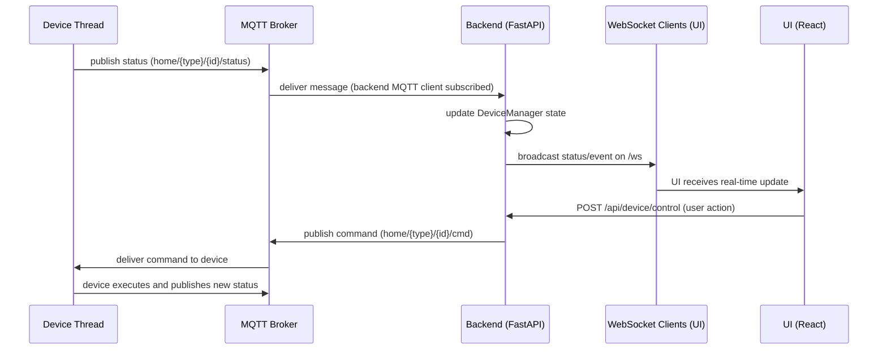

# projek-sistem-terdistribusi

This repository contains a minimal IoT Home Automation prototype using MQTT for device communication, a Python FastAPI backend, and a React-based UI.

## Quick goals
- All device communication is via MQTT.
- Backend provides REST endpoints and an optional WebSocket broadcaster.
- UI can control devices and (optionally) receive real-time updates.

## Workflow & Data Flow

This section explains how the pieces fit together and the expected runtime flow.

- **Components**:
	- Mosquitto MQTT broker: handles publish/subscribe for all devices and backend.
	- Backend (FastAPI): runs `backend.api.main`, manages device threads via `DeviceManager`, subscribes/publishes MQTT, exposes REST and a WebSocket endpoint.
	- Devices (simulated device modules): individual Python modules (lamp, thermostat, AC, TV, cameras, smart_gate) run as threads and communicate only via MQTT topics.
	- UI (React): fetches device list via REST, can send control requests to the backend, and optionally connects to the backend WebSocket for live updates.

- **Topic conventions** (used throughout the project):
	- Status/telemetry: `home/{device_type}/{device_id}/status`
	- Commands: `home/{device_type}/{device_id}/cmd`
	- Events/alerts: `home/{device_type}/{device_id}/event`

- **Runtime data flow**:
	1. Device thread publishes telemetry or status updates to its `home/.../status` topic.
	2. The backend's MQTT client receives these messages (it subscribes to the relevant wildcard topics) and:
		 - updates internal `DeviceManager` state,
		 - optionally broadcasts the message to connected WebSocket clients (`/ws`) for real-time UI updates.
	3. The UI initially fetches `GET /api/devices` (REST) to populate the view. In Manual mode it only updates on `Refresh`; in Real-time mode it opens a WS connection to receive messages pushed from the backend.
	4. When a user sends a control action from the UI, the frontend calls `POST /api/device/control`. The backend validates the request and publishes a command on `home/{device_type}/{device_id}/cmd`.
	5. The corresponding device (or a simulated device thread) receives the command via MQTT and performs the action, publishing any resulting status back to `home/.../status`.

- **Startup order (recommended)**:
	1. Ensure Mosquitto is running.
	2. Start the backend (from the repo root so Python can import the `backend` package):
		 - create/activate venv and `pip install -r backend/requirements.txt`, then run `uvicorn backend.api.main:app`.
	3. Start the UI:
		 - Development: `npm start` (dev server proxies `/api` to backend), or
		 - Production: `npm run build` and serve `ui/build` from a server that proxies `/api` to `http://127.0.0.1:8000`, or run the backend-mounted static files (see Troubleshooting/Notes below).

- **Notes & troubleshooting**:
	- The Create React App dev server uses the `proxy` in `ui/package.json` to forward `/api` to the backend; a static build served directly (e.g., `npx serve -s build`) will not forward `/api` and therefore must either be proxied by a webserver or built with an explicit API base URL.
	- If you see `ModuleNotFoundError: No module named 'backend'`, make sure you ran `uvicorn` from the repository root (not from `backend/`).
	- If the UI shows "No devices found" when served statically, check the Network tab in the browser devtools and inspect the `/api/devices` request — it often means the UI cannot reach the backend due to same-origin/proxy issues.

### Architecture diagrams

Below are two representations of the system: a node-style architecture diagram (components and connections) and a sequence/flow diagram (runtime message flow). The diagrams are provided as Mermaid blocks (rendered on platforms that support Mermaid) plus a simple ASCII fallback so they're readable everywhere.

Architecture (node graph) — Mermaid:

```mermaid
graph LR
	subgraph Devices
		Lamp[Lamp Thread]
		Thermo[Thermostat Thread]
		AC[AC Thread]
		TV[TV Thread]
		Camera[Camera Threads]
		Gate[Smart Gate Thread]
	end

	MQTT[MQTT Broker (Mosquitto)]

	subgraph Backend
		MqttClient[MQTT Client]
		DeviceMgr[DeviceManager]
		API[FastAPI REST API]
		WS[WebSocket /ws]
	end

	UI[React UI]

	Devices -->|publish status| MQTT
	UI -->|REST /api/*| API
	API -->|publish cmd| MQTT
	MQTT -->|deliver| MqttClient
	MqttClient --> DeviceMgr
	MqttClient --> WS
	WS <--> UI
	DeviceMgr <--> API

	%% Note: removed custom style directives to improve GitHub Mermaid compatibility
```

Architecture (ASCII fallback):

```
	[Devices] --publish status--> [MQTT Broker]
														 ^
														 |
												 subscribe
														 |
	[React UI] <--ws/ws--> [Backend MQTT Client + WS + API] <---> [DeviceManager]
			 |                         ^                          
			 |--REST /api/*----------> |                          
																|                          
													 [MQTT Broker] --deliver cmd--> [Devices]
```

Sequence / Flow (runtime) — Mermaid sequence diagram:



Sequence / Flow (ASCII fallback):

```
	Device -> MQTT Broker : status
	MQTT Broker -> Backend MQTT Client : message
	Backend -> DeviceManager : update internal state
	Backend -> WebSocket clients : broadcast message
	Web UI : receives message and updates view

	Web UI -> Backend : POST /api/device/control
	Backend -> MQTT Broker : publish cmd
	MQTT Broker -> Device : deliver cmd
	Device -> MQTT Broker : publish result/status
```


---

## Run steps (step-by-step)

These instructions assume you're on a Linux machine and the repo root is `/home/aryo/projek-sistem-terdistribusi/projek-sistem-terdistribusi`.

1) Start / enable Mosquitto MQTT broker (system-wide)

```bash
sudo systemctl enable --now mosquitto
sudo systemctl status mosquitto   # optional: check service status
```

2) Backend: create and activate Python venv, install deps

```bash
cd /home/aryo/projek-sistem-terdistribusi/projek-sistem-terdistribusi
python3 -m venv backend/.venv
source backend/.venv/bin/activate
pip install --upgrade pip
# projek-sistem-terdistribusi

This repository contains a minimal IoT Home Automation prototype using MQTT for device communication, a Python FastAPI backend, and a React-based UI.

This README provides explicit, copy-pasteable terminal commands and a step-by-step workflow so you can run the backend, the UI, and observe/send MQTT messages.

---

Terminology and terminal mapping

- Repo root: `/home/aryo/projek-sistem-terdistribusi/projek-sistem-terdistribusi`
- Please open separate terminal windows or tabs and label them as follows:
	- Terminal A — Backend (Python / Uvicorn)
	- Terminal B — UI (React dev server or production serve)
	- Terminal C — MQTT monitor (mosquitto_sub)
	- Terminal D — MQTT publisher for tests (mosquitto_pub)
	- Terminal E (optional) — API tests (curl)

Important: Always start the backend (`uvicorn`) from the repo root so the `backend` package imports work correctly.

---

Full step-by-step run & test instructions

Step 0 — (one-time) install system MQTT client tools if needed

```bash
sudo apt update
sudo apt install -y mosquitto mosquitto-clients # Debian/Ubuntu
```

Step 1 — Terminal C: Start Mosquitto and open an MQTT monitor

```bash
# enable and start the mosquitto service
sudo systemctl enable --now mosquitto

# monitor all topics (topic and payload)
mosquitto_sub -h localhost -t '#' -v
```

Leave Terminal C open to observe MQTT messages in real time.

Step 2 — Terminal A: Backend setup and start

```bash
cd /home/aryo/projek-sistem-terdistribusi/projek-sistem-terdistribusi

# create virtual environment (one-time)
python3 -m venv backend/.venv

# activate it
source backend/.venv/bin/activate

# install Python dependencies (one-time or when requirements change)
pip install --upgrade pip
pip install -r backend/requirements.txt

# start the backend (development, autoreload)
uvicorn backend.api.main:app --host 0.0.0.0 --port 8000 --reload
```

Notes for Terminal A:
- The backend exposes:
	- REST API: `http://localhost:8000/api/devices` and `POST /api/device/control`
	- Health: `http://localhost:8000/health`
	- WebSocket (optional): `ws://localhost:8000/ws` (backend broadcasts MQTT messages here)
- If you see `ModuleNotFoundError: No module named 'backend'`, you are not in the repo root — move to the repo root and re-run.

Step 3 — Terminal B: Start the UI (pick one option)

Option A — Development (fast feedback, automatic CRA refresh):

```bash
cd /home/aryo/projek-sistem-terdistribusi/projek-sistem-terdistribusi/ui
npm install
npm start
```

Option B — Production build (no dev auto-refresh; manual browser refresh only):

```bash
cd /home/aryo/projek-sistem-terdistribusi/projek-sistem-terdistribusi/ui
npm install
npm run build
npx serve -s build
```

UI behavior notes:
- By default the UI does one initial load and then refreshes only when you click the `Refresh` button (manual mode).
- Enable the `Real-time` checkbox in the UI header to open a WebSocket connection (`ws://localhost:8000/ws`) for automatic updates.

Step 4 — Terminal D: Publish MQTT test messages

Simulate a device status update (lamp example):

```bash
mosquitto_pub -h localhost -t 'home/lamp/lamp01/status' -m '{"state":{"power":"on","brightness":80}}'
```

If Real-time mode is ON the UI will update automatically. If Real-time mode is OFF, click `Refresh` in the UI to fetch the latest state.

### Additional MQTT publish examples
Use these to simulate different device types and events (copy-paste into a terminal):

```bash
# Lamp
mosquitto_pub -h localhost -t 'home/lamp/lamp01/status' -m '{"state":{"power":"on","brightness":80}}'

# AC
mosquitto_pub -h localhost -t 'home/ac/ac01/status' -m '{"state":{"power":"on","target_temp":22}}'

# Thermostat
mosquitto_pub -h localhost -t 'home/thermostat/thermo01/status' -m '{"state":{"setpoint":24}}'

# Camera
mosquitto_pub -h localhost -t 'home/camera_front/cam01/status' -m '{"event":"motion"}'

# Smart gate
mosquitto_pub -h localhost -t 'home/smart_gate/gate01/status' -m '{"state":{"open":true}}'
```

Step 5 — Terminal E: Quick API checks (optional)

List devices:

```bash
curl http://localhost:8000/api/devices
```

Send a control request (example):

```bash
curl -X POST http://localhost:8000/api/device/control \
	-H 'Content-Type: application/json' \
	-d '{"device_id":"lamp01","device_type":"lamp","action":"toggle","params":{}}'
```

---

End-to-end quick verification

1. Terminal C: `mosquitto_sub -h localhost -t '#' -v` (observe all MQTT messages)
2. Terminal A: start backend (see Step 2)
3. Terminal B: start UI and open in browser (see Step 3)
4. Terminal D: publish test message (see Step 4)
5. In the browser, click `Refresh` (Manual) or enable `Real-time` to see the update.

---

Troubleshooting

- `ModuleNotFoundError: No module named 'backend'`: run `uvicorn` from the repo root (`cd /home/aryo/projek-sistem-terdistribusi/projek-sistem-terdistribusi`).
- `paho-mqtt` install fails: make sure `backend/requirements.txt` contains `paho-mqtt==1.6.1` and retry `pip install -r backend/requirements.txt`.
- No MQTT messages visible: confirm Mosquitto is running (`sudo systemctl status mosquitto`) and that you publish to the correct host and port (default `localhost:1883`).
- Verify messages locally with `mosquitto_sub -h localhost -t '#' -v`.

Extras (optional enhancements)

- Add `localStorage` persistence for the Real-time toggle so the UI remembers your preference on reload.
- Add command ACK topics (device -> backend -> UI) to show control confirmations.
- Add a small script to open terminals and start services in `tmux` or `screen` — I can add this on request.

Recent fixes (applied while verifying the project)

- Removed a local `eslint-plugin-react-hooks` devDependency from `ui/package.json` to resolve a build-time
	conflict with Create React App's built-in ESLint configuration. If you see an ESLint plugin conflict when
	running `npm run build`, either remove `ui/.eslintrc.json` or avoid re-adding the `eslint-plugin-react-hooks`
	devDependency — CRA already supplies the react-hooks rules.

	Commands I used while testing (already performed in this environment):

	```bash
	# build UI
	cd /home/aryo/projek-sistem-terdistribusi/projek-sistem-terdistribusi/ui
	npm install --no-audit --no-fund
	npm run build

	# start backend (from repo root so `backend` imports work)
	cd /home/aryo/projek-sistem-terdistribusi/projek-sistem-terdistribusi
	python3 -m venv backend/.venv
	source backend/.venv/bin/activate
	pip install -r backend/requirements.txt
	backend/.venv/bin/uvicorn backend.api.main:app --host 127.0.0.1 --port 8000 --reload > backend/uvicorn.log 2>&1 &

	# serve the built UI
	npx serve -s ui/build -l 3000 > serve-ui.log 2>&1 &
	```
If you'd like, tell me whether you want a single script to start backend+monitor or if you prefer a `tmux` script to open and run all terminals. I can add that next.
